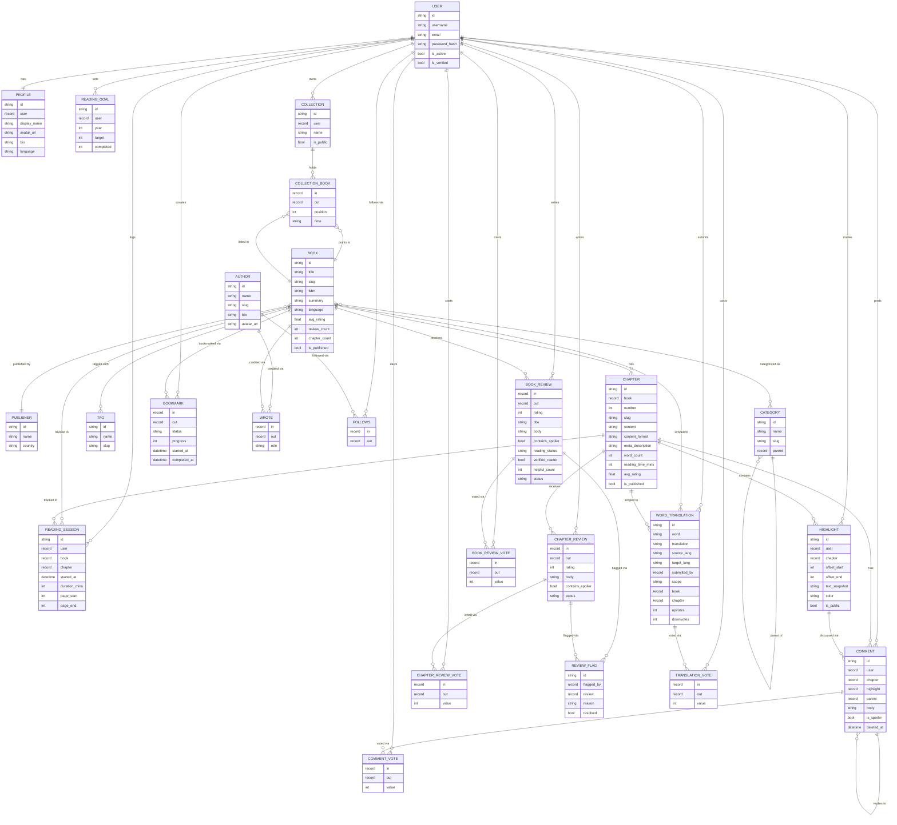

# Entity Relationship Diagram

```mermaid
erDiagram
    USER {
        string id
        string username
        string email
        string password_hash
        bool   is_active
        bool   is_verified
    }
    PROFILE {
        string   id
        record   user
        string   display_name
        string   avatar_url
        string   bio
        string   language
    }
    AUTHOR {
        string   id
        string   name
        string   slug
        string   bio
        string   avatar_url
    }
    PUBLISHER {
        string id
        string name
        string country
    }
    CATEGORY {
        string id
        string name
        string slug
        record parent
    }
    TAG {
        string id
        string name
        string slug
    }
    BOOK {
        string   id
        string   title
        string   slug
        string   isbn
        string   summary
        string   language
        float    avg_rating
        int      review_count
        int      chapter_count
        bool     is_published
    }
    CHAPTER {
        string   id
        record   book
        int      number
        string   slug
        string   content
        string   content_format
        string   meta_description
        int      word_count
        int      reading_time_mins
        float    avg_rating
        bool     is_published
    }
    BOOKMARK {
        record   in
        record   out
        string   status
        int      progress
        datetime started_at
        datetime completed_at
    }
    WROTE {
        record in
        record out
        string role
    }
    FOLLOWS {
        record in
        record out
    }
    READING_SESSION {
        string   id
        record   user
        record   book
        record   chapter
        datetime started_at
        int      duration_mins
        int      page_start
        int      page_end
    }
    READING_GOAL {
        string id
        record user
        int    year
        int    target
        int    completed
    }
    COLLECTION {
        string id
        record user
        string name
        bool   is_public
    }
    COLLECTION_BOOK {
        record in
        record out
        int    position
        string note
    }
    HIGHLIGHT {
        string id
        record user
        record chapter
        int    offset_start
        int    offset_end
        string text_snapshot
        string color
        bool   is_public
    }
    COMMENT {
        string id
        record user
        record chapter
        record highlight
        record parent
        string body
        bool   is_spoiler
        datetime deleted_at
    }
    COMMENT_VOTE {
        record in
        record out
        int    value
    }
    BOOK_REVIEW {
        record   in
        record   out
        int      rating
        string   title
        string   body
        bool     contains_spoiler
        string   reading_status
        bool     verified_reader
        int      helpful_count
        string   status
    }
    CHAPTER_REVIEW {
        record in
        record out
        int    rating
        string body
        bool   contains_spoiler
        string status
    }
    BOOK_REVIEW_VOTE {
        record in
        record out
        int    value
    }
    CHAPTER_REVIEW_VOTE {
        record in
        record out
        int    value
    }
    REVIEW_FLAG {
        string id
        record flagged_by
        record review
        string reason
        bool   resolved
    }
    WORD_TRANSLATION {
        string id
        string word
        string translation
        string source_lang
        string target_lang
        record submitted_by
        string scope
        record book
        record chapter
        int    upvotes
        int    downvotes
    }
    TRANSLATION_VOTE {
        record in
        record out
        int    value
    }

    USER         ||--||  PROFILE           : "has"
    USER         ||--o{  BOOKMARK          : "creates"
    USER         ||--o{  BOOK_REVIEW       : "writes"
    USER         ||--o{  CHAPTER_REVIEW    : "writes"
    USER         ||--o{  HIGHLIGHT         : "makes"
    USER         ||--o{  COMMENT           : "posts"
    USER         ||--o{  COLLECTION        : "owns"
    USER         ||--o{  READING_SESSION   : "logs"
    USER         ||--o{  READING_GOAL      : "sets"
    USER         ||--o{  FOLLOWS           : "follows via"
    USER         ||--o{  COMMENT_VOTE      : "casts"
    USER         ||--o{  BOOK_REVIEW_VOTE  : "casts"
    USER         ||--o{  CHAPTER_REVIEW_VOTE : "casts"
    USER         ||--o{  TRANSLATION_VOTE  : "casts"
    USER         ||--o{  WORD_TRANSLATION  : "submits"

    AUTHOR       ||--o{  WROTE             : "credited via"
    AUTHOR       ||--o{  FOLLOWS           : "followed via"

    BOOK         ||--o{  WROTE             : "credited via"
    BOOK         ||--o{  CHAPTER           : "has"
    BOOK         ||--o{  BOOKMARK          : "bookmarked via"
    BOOK         ||--o{  BOOK_REVIEW       : "receives"
    BOOK         ||--o{  COLLECTION_BOOK   : "listed in"
    BOOK         ||--o{  READING_SESSION   : "tracked in"
    BOOK         }o--||  PUBLISHER         : "published by"
    BOOK         }o--o{  CATEGORY          : "categorized as"
    BOOK         }o--o{  TAG               : "tagged with"
    BOOK         ||--o{  WORD_TRANSLATION  : "scoped to"

    CHAPTER      ||--o{  CHAPTER_REVIEW    : "receives"
    CHAPTER      ||--o{  HIGHLIGHT         : "contains"
    CHAPTER      ||--o{  COMMENT           : "has"
    CHAPTER      ||--o{  READING_SESSION   : "tracked in"
    CHAPTER      ||--o{  WORD_TRANSLATION  : "scoped to"

    COLLECTION   ||--o{  COLLECTION_BOOK   : "holds"
    COLLECTION_BOOK }o--||  BOOK           : "points to"

    HIGHLIGHT    ||--o{  COMMENT           : "discussed via"
    COMMENT      ||--o{  COMMENT           : "replies to"
    COMMENT      ||--o{  COMMENT_VOTE      : "voted via"

    BOOK_REVIEW     ||--o{  BOOK_REVIEW_VOTE    : "voted via"
    CHAPTER_REVIEW  ||--o{  CHAPTER_REVIEW_VOTE : "voted via"
    BOOK_REVIEW     ||--o{  REVIEW_FLAG         : "flagged via"
    CHAPTER_REVIEW  ||--o{  REVIEW_FLAG         : "flagged via"

    CATEGORY     ||--o{  CATEGORY          : "parent of"

    WORD_TRANSLATION ||--o{  TRANSLATION_VOTE : "voted via"
```
